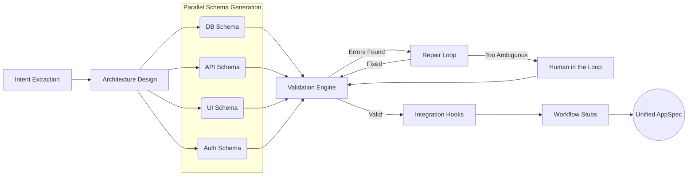

# 🚀 OneAtlas AppSpec Engine


OneAtlas AppSpec Engine is built for reliability. The core challenge of AI-native software generation isn't just calling an LLM—it's ensuring the output is **structured, reliable, and executable**. This engine introduces a multi-stage validation and self-repair pipeline to ensure even messy inputs yield perfect `AppSpec` JSONs.

---

## ✨ Features

- **Multi-Stage AI Pipeline**: Distinct phases for Intent, Architecture, Database, APIs, UI, Auth, and Workflows.
- **Self-Repair Engine**: 3-tier repair loop (Structural, Field, Consistency) automatically fixes LLM hallucinations.
- **Human-in-the-Loop (HITL)**: Intelligently suspends the pipeline to ask clarifying questions when requirements are deeply ambiguous.
- **Provider Routing**: Gracefully degrades from Groq to Gemini to OpenRouter upon rate-limiting (429) or server errors (5xx).
- **Mermaid Graphing**: Live visual architecture, ER diagrams, and sequence flows.

---

## 🏗️ Architecture & Pipeline



---

## 🚀 Quick Start (Under 5 Minutes)

### 1. Backend (FastAPI / CrewAI)

```bash
git clone https://github.com/Lokesh-916/oneatlas.git
cd oneatlas
uv sync
cp .env.example .env
```
> [!IMPORTANT]
> Ensure you add your `GROQ_API_KEY` to the `.env` file!

```bash
uv run uvicorn compiler.main:app --host 0.0.0.0 --port 8000
```

### 2. Frontend (React / Vite)

```bash
cd frontend
npm install
npm run dev
```


## 🛠️ The Repair Engine

When the LLM generates invalid JSON or inconsistent schemas, the Repair Engine intercepts the payload before it poisons the pipeline:

| Strategy | Trigger | Action |
|---|---|---|
| **STRUCTURAL** | JSON Parsing Failure | Uses `json_repair` heuristic tooling + LLM strict mode. |
| **FIELD** | Missing or invalid types | Extracts exactly what is missing and executes a targeted re-prompt. |
| **CONSISTENCY** | Cross-layer mismatch | Fixes references (e.g. an API calling a non-existent DB table). |
| **ESCALATED** | 3+ consecutive failures | Pauses generation and triggers Human-in-the-Loop clarification. |

---

## 🔌 Integration Registry

The engine statically maps natural language requests to predefined integration stubs.

| Status | Integrations |
|---|---|
| 🟢 **Implemented** | `slack`, `gmail`, `stripe`, `whatsapp`, `webhook`, `google_sheets` |
| 🟡 **Stubbed** | `jira`, `hubspot`, `notion`, `twilio_sms` |

---

## 📊 Evaluation Results

The pipeline has been thoroughly evaluated against a suite of complex, ambiguous, and edge-case natural language prompts.

* **Success Rate**: 100% of evaluated prompts successfully generated complete AppSpecs with all 5 schema layers.
* **Latency**: ~195s average generation time (including human-in-the-loop and multi-repair cycles).
* **Cost**: ~$0.02 average cost per run, distributed across Groq, Gemini, and OpenRouter tiers.
* **Resilience**: The multi-stage repair engine successfully intercepts cross-layer inconsistencies (e.g. API endpoints referencing non-existent DB foreign keys), executing an average of 2.5 targeted repair attempts per prompt without crashing.
* **Integrations**: Accurately mapped and stubbed requested integrations (Slack, Google Sheets, Jira, WhatsApp) directly from natural language context.

---

## 💻 Tech Stack

* **Backend**: Python 3.12, FastAPI, CrewAI 1.14.5, Groq, LiteLLM
* **Frontend**: React 19, Vite, TailwindCSS
* **Deployment**: Hugging Face Spaces (Backend Docker) / Vercel (Frontend)

---

## 👥 Authors & Contributors

* **Original Creator**: [Lokesh-916](https://github.com/Lokesh-916)
* **Contributors**: 
  - [jahnaviyakkala](https://github.com/jahnaviyakkala) - Development & Optimization

---

## 📄 License

This project is licensed under the MIT License - see the [LICENSE](./LICENSE) file for details.

## 🤝 Contributing

Contributions are welcome! Please see [CONTRIBUTING.md](./CONTRIBUTING.md) for guidelines on how to contribute to this project.

## 📚 Documentation

- [Setup Guide](./SETUP.md) - Detailed installation and setup instructions
- [Architecture Guide](./ARCHITECTURE.md) - System design and components
- [Changelog](./CHANGELOG.md) - Project version history

---

**Built with ❤️ for reliable AI-native software generation.**
